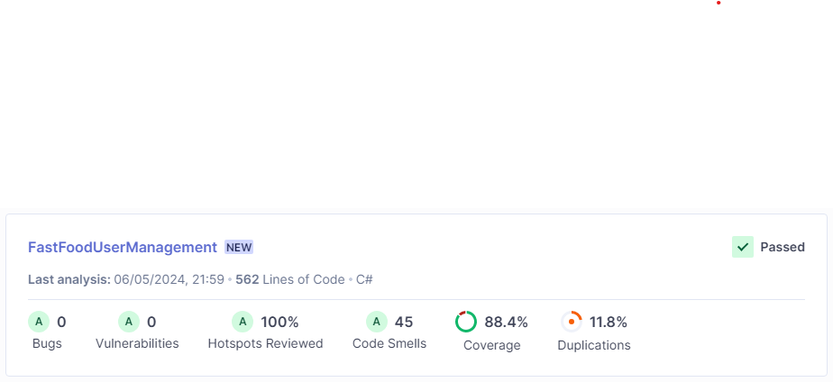
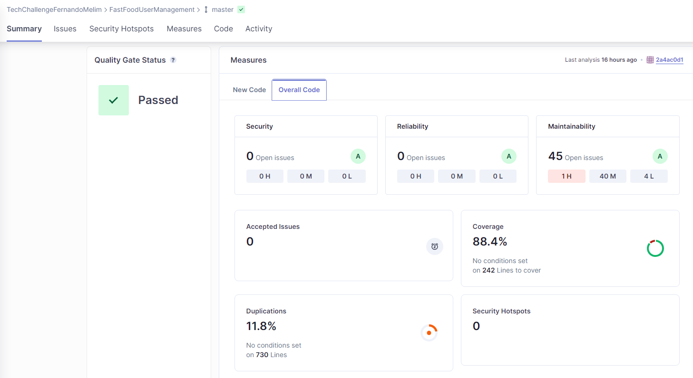

# FastFoodUserManagement

O repositorio FastFoodUserManagement tem por objetivo implementar uma Lambda Function responsável por realizar a criação e autenticação de usuários utilizando o AWS Cognito.

### Variáveis de ambiente
Todas as variáveis de ambiente do projeto visam fazer integração com algum serviço da AWS. Explicaremos a finalidade de cada uma:

- AWS_ACCESS_KEY_DYNAMO: "Access key" da AWS. Recurso gerado no IAM para podermos nos conectar aos serviços da AWS;
- AWS_SECRET_KEY_DYNAMO: "Secret key" da AWS. Recurso gerado no IAM para podermos nos conectar aos serviços da AWS. Deve ser utilizado corretamente com seu par AWS_ACCESS_KEY_DYNAMO;
- AWS_TABLE_NAME_DYNAMO: Nome da tabela de usuários cadastrada no DynamoDB;
- AWS_USER_POOL_ID: Nome da user pool criada no AWS Cognito;
- AWS_CLIENT_ID_COGNITO: ClientId da pool no AWS Cognito;
- GUEST_EMAIL: Usuário padrão para realizar autenticação de forma anônima no AWS Cognito;
- GUEST_IDENTIFICATION: senha do usuário padrão para realizar autenticação de forma anônima no AWS Cognito.
- AWS_SQS: Url da fila de log no SQS da AWS.
- AWS_SQS_GROUP_ID: Group Id da fila de log no SQS da AWS.

### Execução

A execução do projeto pode ser feita buildando o dockerfile na raiz do repositório e depois executando a imagem gerada em um container. O serviço foi testado sendo executado direto pelo visual Studio e pela AWS.

### Testes

Conforme foi solicitado, estou postando aqui as evidências de cobertura dos testes. A cobertura foi calculada via integração com o [SonarCloud](https://sonarcloud.io/) e pode ser vista nesse [link](https://sonarcloud.io/organizations/techchallengefernandomelim/projects). A integração com todos os repositórios poderá ser vista nesse link.

Através das imagens é possível observar que a cobertura por testes unitários ficou superior a 80%, conforme solicitado.
