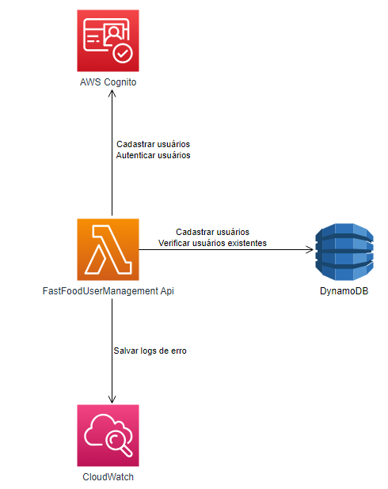

# FastFoodUserManagement

O repositorio FastFoodUserManagement tem por objetivo implementar uma Lambda Function responsável por realizar a criação e autenticação de usuários utilizando o AWS Cognito.

## Github Actions
### Necessário
* Configurar no GitHub as *Secrets and variables*, entrando em *Actions* e adicionando na parte *Repository secrets* a seguinte:
  * AWS_ACCESS_KEY_ID 
  * AWS_SECRET_ACCESS_KEY
* Rodar a primeira run no [Repositório Terraform](https://github.com/postech-fiap-4soat-g01/aws-infrastructure-live), para criação do ECR e RDS do SQL

Esse projeto tem um workflow de subir a imagem do projeto ao ECR ao realizar o merge para a branch main.
A atualização da lambda no workflow *Update Lambda* está de forma manual, usando a branch master como base, necessário rodar ela somente após a RUN 2 [Repositório Terraform](https://github.com/postech-fiap-4soat-g01/aws-infrastructure-live) tiver executado, pois ela atualizada a lambda que essa run criará.

Caso prefira, é possível realizar o download da [collection](https://github.com/postech-fiap-4soat-g01/FastFoodTotem/blob/main/FastFoodTotem%20-%20Jornada%20dos%20Usu%C3%A1rios.postman_collection.json) e utilizar no postman.

## Execução do proejto
Para executar o projeto é fácil, basta apenas definir os valores paras as variáveis de ambiente dele, que se encontram no launchsettings.json da API que está presente na camada Presentation.
Após isso, basta executar o projeto da forma que preferir, nós utilizamos o Docker para isso.

### Variáveis de ambiente
Todas as variáveis de ambiente do projeto visam fazer integração com algum serviço da AWS. Explicaremos a finalidade de cada uma:

- AWS_ACCESS_KEY_DYNAMO: "Access key" da AWS. Recurso gerado no IAM para podermos nos conectar aos serviços da AWS;
- AWS_SECRET_KEY_DYNAMO: "Secret key" da AWS. Recurso gerado no IAM para podermos nos conectar aos serviços da AWS. Deve ser utilizado corretamente com seu par AWS_ACCESS_KEY_DYNAMO;
- AWS_TABLE_NAME_DYNAMO: Nome da tabela de usuários cadastrada no DynamoDB;
- LOG_REGION: Região do Log Group criado no Cloudwatch para monitoramento de logs;
- LOG_GROUP: Nome do Log Group criado no Cloudwatch para monitoramento de logs;
- AWS_USER_POOL_ID: Nome da user pool criada no AWS Cognito;
- AWS_CLIENT_ID_COGNITO: ClientId da pool no AWS Cognito;
- GUEST_EMAIL: Usuário padrão para realizar autenticação de forma anônima no AWS Cognito;
- GUEST_IDENTIFICATION: senha do usuário padrão para realizar autenticação de forma anônima no AWS Cognito.

### Execução com Docker

Utilize o seguinte comando na pasta raiz do projeto para criar a imagem Docker

```
docker build -t fast_food_user_management -f .\src\Presentation\FastFoodUserManagement\Dockerfile .
```

Utilize o seguinte comando para subir um container com essa imagem:

```
	docker run -d -p 8080:8080 \
	-e AWS_ACCESS_KEY_DYNAMO="sua_access_key" \
	-e AWS_SECRET_KEY_DYNAMO="sua_secret_key" \
	-e AWS_TABLE_NAME_DYNAMO="nome_da_tabela" \
	-e LOG_REGION="regiao_do_log_group" \
	-e LOG_GROUP="nome_do_log_group" \
	-e AWS_USER_POOL_ID="id_da_user_pool" \
	-e AWS_CLIENT_ID_COGNITO="client_id_do_cognito" \
	-e GUEST_EMAIL="email_do_usuario_padrao" \
	-e GUEST_IDENTIFICATION="senha_do_usuario_padrao" \
	fast_food_user_management
```

ou 

```
docker run -d -p 8080:8080 -e AWS_ACCESS_KEY_DYNAMO="sua_access_key" -e AWS_SECRET_KEY_DYNAMO="sua_secret_key" -e AWS_TABLE_NAME_DYNAMO="nome_da_tabela" -e LOG_REGION="regiao_do_log_group" -e LOG_GROUP="nome_do_log_group" -e AWS_USER_POOL_ID="id_da_user_pool" -e AWS_CLIENT_ID_COGNITO="client_id_do_cognito" -e GUEST_EMAIL="email_do_usuario_padrao" -e GUEST_IDENTIFICATION="senha_do_usuario_padrao" fast_food_user_management
```

Dessa forma o container estará executando a API.

## Arquitetura do projeto
A seguinte arquitetura foi utilizada para o projeto:



Utilizamos 3 serviços da AWS apenas nese projeto: AWS Cognito, Cloudwatch e DynamoDB.

Como decidimos utilizar a AWS como plataforma nuvem, utilizamos o AWS Cognito para trabalharmos com gerenciamento dos nossos usuários. Através dela, conseguimos cadastrar e autenticar usuários de forma fácil.
Para gerenciar melhor os dados do usuário, optamos por utilizar o DynamoDB. Por ser um banco estruturado em tabelas e não tendo a necessidade de utilizar mais do que uma, pensamos em utilizá-lo para armazenar os dados dos usuários cadastrados. Nessa solução, apenas uma tabela foi utilizada, o nome dela deve ser fornecido pela variável de ambiente AWS_TABLE_NAME_DYNAMO. Como apenas uma única tabela foi utilizada, excluímos a necessidade de utilizar um sgbd relacional. Utilizar um NoSQL nos dá uma liberdade maior caso seja necessário fazer alterações no esquema de usuários salvo no banco, algo que seria mais complicado de se lidar no modelo relacional, onde teríamos que nos preocupar com a criação do esquema e com o versionamento do mesmo.
Para lidar com os erros ocorridos na execução do código fonte, utilizamos o Cloudwatch, onde salvamos todos os logs necessários de exceções disparadas durante a execução de alguma funcionalidade.
Conforme foi solicitado, essa solução está sendo publicada como uma Lambda function.

## Endpoints

Esse projeto possui 4 endpoints:

GET /User/GetUsers -> Responsável por retornar todos os usuários cadastrados na base do cognito.

POST /User/CreateUser -> Responsável por criar um usuário com o seguinte json:
```
{
	"name": "nome_teste",
	"email": "email@teste.com",
	"identification": "cpf"
}
```

GET /User/AuthenticateUser/{cpf} -> Responsável por autenticar o usuário com seu cpf

GET /User/AuthenticateAsGuest -> Responsável por autenticar o usuário como anônimo

## Outros Repositórios do trabalho

Terraform: https://github.com/postech-fiap-4soat-g01/aws-infrastructure-live

Monolito: https://github.com/postech-fiap-4soat-g01/FastFoodTotem
